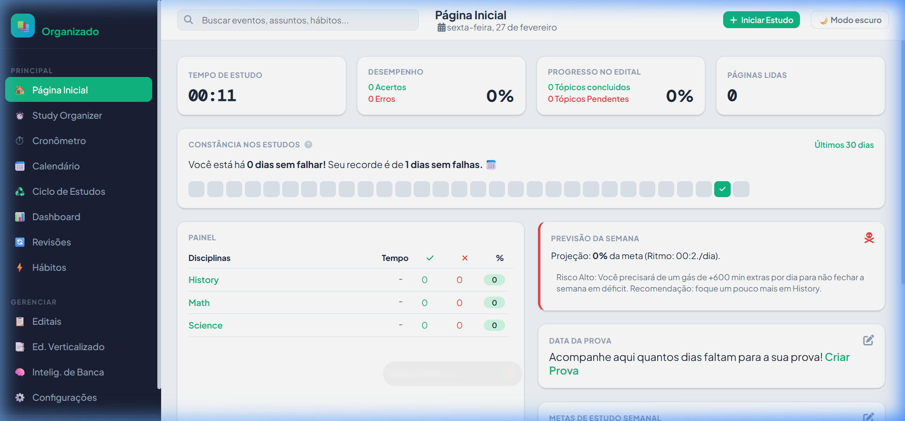
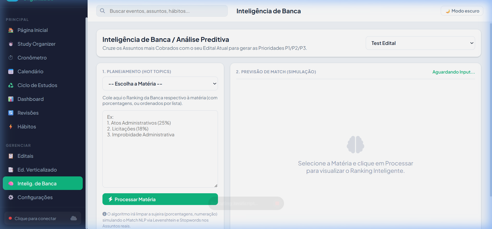
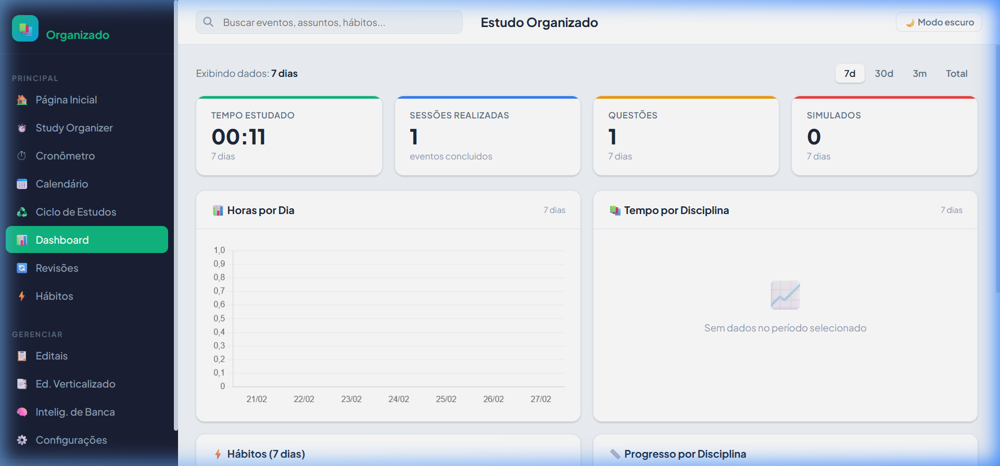
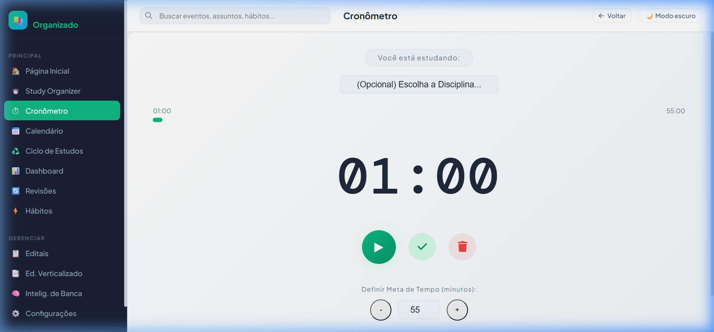

# 📚 Estudo Organizado

Aplicação web premium para **planejamento e organização de estudos** voltada para concursos públicos. Baseada no **Ciclo PDCA**: planeje no Calendário, execute no Study Organizer, meça no Dashboard e corrija com as Revisões.


---

## 📸 Visual Showcase

Confira a interface moderna e responsiva do Estudo Organizado:

<p align="center">
  
  
</p>
<p align="center">
  
  
</p>

---

## 🌟 Últimas Atualizações

### Waves 34, 35 e 36 — Inteligência de Bancas
- **Aba Dedicada de Análise Preditiva (Wave 34):** A funcionalidade de "Inteligência de Banca" ganhou uma Aba Preditiva em Tela Cheia (Dual-Pane), libertando-a da limitação visual dos modals antigos.
- **Gerenciamento de Análises Inteligentes (Waves 35 e 36):** Inclusão de um Histórico de "Análises Salvas" em chips, permitindo ao usuário re-visualizar relatórios de Match antigos, editar pontuações, ou excluí-los (retornando dinamicamente o Edital para a Ordem Alfabética Padrão).

### Wave 30 — PWA Nativo
- **Instalação e Modo Offline:** O sistema agora é um Progressive Web App completo. Com o registro do `manifest.json` e do `sw.js` (Service Worker), estudantes podem instalar o app nativamente. O SW conta com modo Cache-First para carregamento instantâneo mesmo offline.

---

## ✨ Funcionalidades Principais

| Módulo | Descrição |
|---|---|
| 🏠 **Página Inicial** | Visão geral do dia: eventos agendados, estudados, atrasados e revisões pendentes. |
| 📖 **Study Organizer** | Registro de sessões de estudo com timer Pomodoro integrado. |
| 📅 **Calendário** | Visualização mensal e semanal dos eventos de estudo. |
| 📊 **Dashboard** | Métricas de desempenho: tempo estudado, sessões, questões e simulados. |
| 🔄 **Revisões** | Sistema de revisão espaçada com intervalos configuráveis (1, 7, 30, 90 dias). |
| ⚡ **Hábitos** | Acompanhamento de hábitos de estudo por categoria (Videoaula, Simulado, etc). |
| 📋 **Editais** | Gestão completa de editais, disciplinas e assuntos. |
| 🧠 **Intelig. de Banca** | Análise preditiva baseada em incidência de temas da banca organizada. |
| ⚙️ **Configurações** | Temas (Furtivo, Rubi, Matrix), calendários, sync e backups. |

---

## 🚀 Como Usar

### Opção 1: Windows Launcher (Recomendado)
Basta dar dois cliques em `Abrir_Estudo_Organizado.bat`. Ele iniciará o servidor local e abrirá o aplicativo automaticamente no seu navegador padrão.

### Opção 2: Servidor Manual
```bash
# Com Python
python -m http.server 8000

# Com Node.js
npx http-server -p 8000
```
Acesse: `http://localhost:8000`

---

## ☁️ Sincronização e Backup

### Cloudflare Multi-Device Sync
Para espelhar seu Estudo Organizado entre celular e PC instantaneamente:
1. Configure seu Worker em `docs/CLOUDFLARE-SETUP.md`.
2. Insira a URL e o Token em **Configurações**.
3. Ative o Sync para pareamento em tempo real.

### Google Drive & Backup Local
- Suporte nativo a **Google Drive API** para salvamento na nuvem.
- Exportação/Importação manual via arquivos **JSON**.

---

## 🏗️ Estrutura do Projeto

O projeto utiliza **Vanilla JavaScript** (Sem frameworks), priorizando performance e simplicidade:

- `src/index.html`: Esqueleto principal.
- `src/js/store.js`: Gerenciamento de estado e IndexedDB.
- `src/js/logic.js`: Regras de negócio e cálculos de performance.
- `src/js/relevance.js`: Motor de NLP e Fuzzy Match para análises de banca.
- `src/js/views.js`: Orquestração de renderização dinâmica.

---

## 📄 Licença

Este projeto está sob a licença MIT. Veja o arquivo [LICENSE](LICENSE) para mais detalhes.

---
<p align="center">Desenvolvido com ❤️ para estudantes de concursos públicos.</p>
