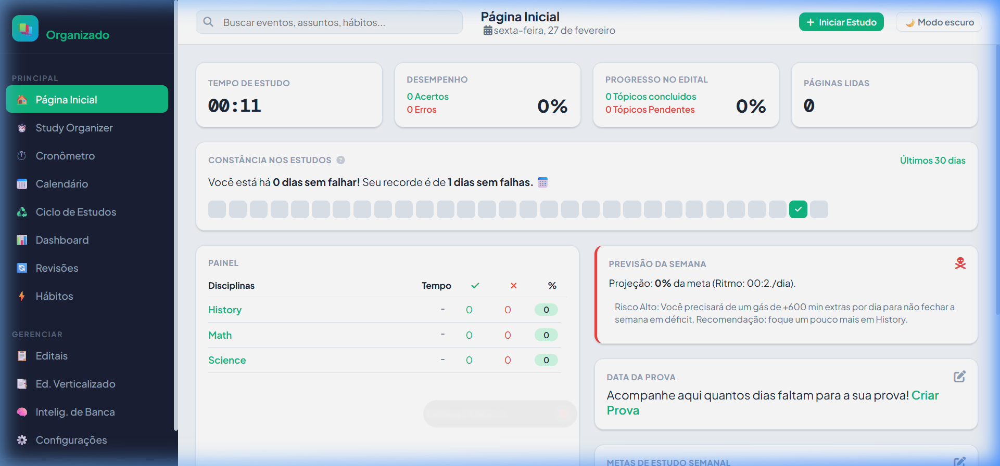
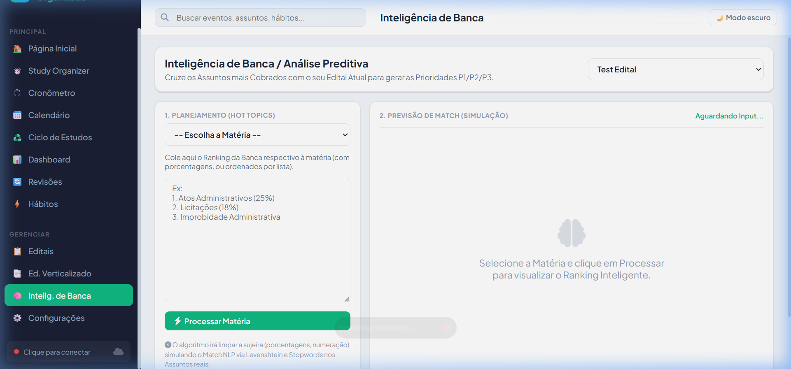
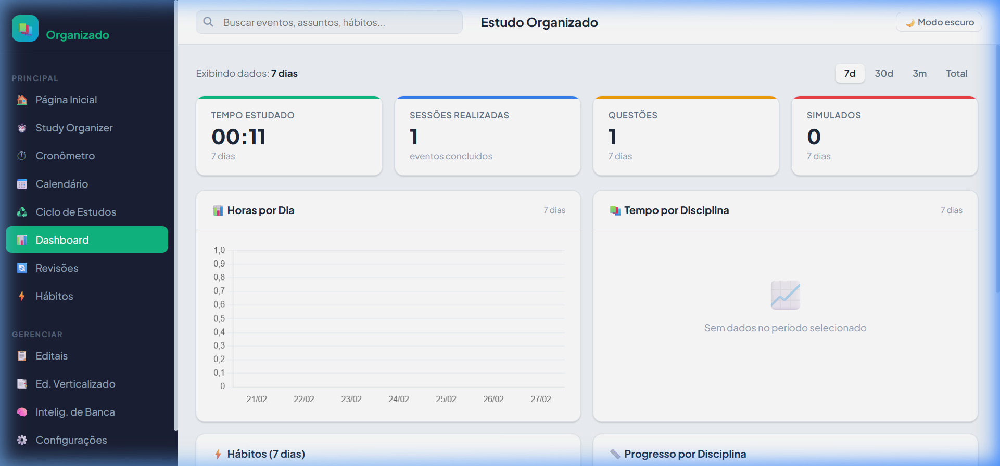
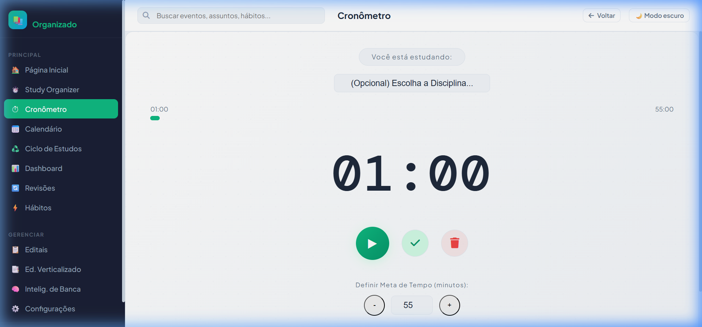

# 📚 Estudo Organizado

Aplicação web premium para **planejamento e organização de estudos** voltada para concursos públicos. Baseada no **Ciclo PDCA**: planeje no Calendário, execute no Study Organizer, meça no Dashboard e corrija com as Revisões.


---

## 📸 Visual Showcase

<p align="center">
  
  
</p>
<p align="center">
  
  
</p>

---

## ✨ Funcionalidades

| Módulo | Descrição |
|---|---|
| 🏠 **Página Inicial** | Visão geral do dia: tempo de estudo, desempenho, progresso no edital, constância e previsão semanal. |
| 📖 **Study Organizer** | Criação e gestão de eventos de estudo com timer integrado (Contínuo e Pomodoro). |
| ⏱ **Cronômetro** | Timer cronômetro livre (sem evento) para sessões avulsas com meta configurável. |
| 📅 **Calendário** | Visualização mensal completa dos eventos de estudo com status colorido. |
| ♻️ **Ciclo de Estudos** | Planejamento inteligente por ciclo ou grade semanal fixa com wizard de 4 etapas. |
| 📊 **Dashboard** | Métricas detalhadas: tempo por disciplina, acertos/erros, páginas lidas e gráficos Chart.js. |
| 🔄 **Revisões** | Sistema de revisão espaçada com intervalos configuráveis (1, 7, 30, 90 dias). |
| ⚡ **Hábitos** | Acompanhamento de hábitos de estudo por categoria (Videoaula, Simulado, Leitura, etc). |
| 📋 **Editais** | Gestão completa de editais, disciplinas, assuntos e aulas com importação em lote. |
| 📑 **Ed. Verticalizado** | Visão verticalizada do edital com progresso por assunto e aula. |
| 🧠 **Intelig. de Banca** | Análise preditiva com NLP e Fuzzy Match — identifica temas de maior incidência (P1/P2/P3). |
| ⚙️ **Configurações** | Temas (Furtivo, Rubi, Matrix, Claro), metas, sync, backup e importação/exportação JSON. |

---

## 🚀 Como Usar

### Opção 1: Windows Launcher (Recomendado)
Basta dar dois cliques em `Abrir_Estudo_Organizado.bat`. Ele iniciará o servidor local e abrirá o app automaticamente.

### Opção 2: Servidor Manual
```bash
# Com Node.js
npx http-server src -p 8080

# Com Python
python -m http.server 8080 --directory src
```
Acesse: `http://localhost:8080`

---

## ☁️ Sincronização e Backup

### Cloudflare Multi-Device Sync
Espelhe seus dados entre celular e PC em tempo real:
1. Configure seu Worker seguindo `docs/CLOUDFLARE-SETUP.md`
2. Insira a URL e o Token em **Configurações**
3. Ative o Sync para pareamento automático

### Google Drive
Conecte via OAuth 2.0 para backup automático na nuvem do Google.

### Backup Local
Exportação e importação manual via **JSON** com validação de integridade.

---

## 🏗️ Estrutura do Projeto

```
src/
├── index.html                 # Esqueleto principal (SPA) + modais
├── manifest.json              # PWA manifest
├── sw.js                      # Service Worker (cache-first)
├── css/
│   └── styles.css             # Design system completo (~3000 linhas)
└── js/
    ├── main.js                # Entry point — expõe módulos ao window
    ├── store.js               # Estado global + IndexedDB + migrações
    ├── app.js                 # Navegação, modais, toasts, temas
    ├── logic.js               # Regras de negócio, timers, dashboard stats
    ├── views.js               # Renderização de todas as views (~4600 linhas)
    ├── components.js           # Componentes reutilizáveis de UI
    ├── utils.js               # Helpers (formatação, escape, cache)
    ├── registro-sessao.js     # Modal de registro de sessão de estudo
    ├── planejamento-wizard.js # Wizard de 4 etapas (Ciclo/Semanal)
    ├── relevance.js           # Motor NLP + Fuzzy Match (Levenshtein)
    ├── lesson-mapper.js       # Auto-link aulas ↔ assuntos
    ├── notifications.js       # Notificações inteligentes (revisões, metas)
    ├── cloud-sync.js          # Cloudflare KV sync
    └── drive-sync.js          # Google Drive API sync
```

### Stack Técnica
- **Zero frameworks** — Vanilla JS puro (~8500 linhas)
- **IndexedDB** — Persistência local com fallback localStorage
- **Chart.js** — Gráficos do Dashboard
- **PWA** — Service Worker + Manifest para instalação nativa

---

## 📄 Licença

Este projeto está sob a licença MIT. Veja o arquivo [LICENSE](LICENSE) para mais detalhes.

---
<p align="center">Desenvolvido com ❤️ para estudantes de concursos públicos.</p>
