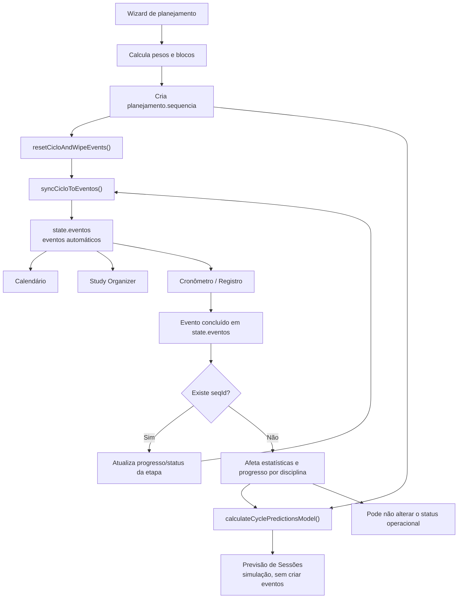
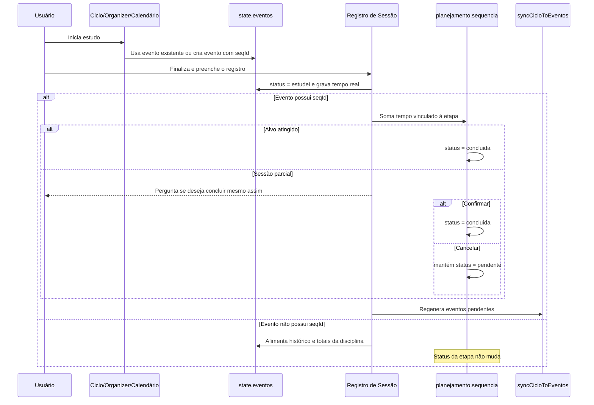
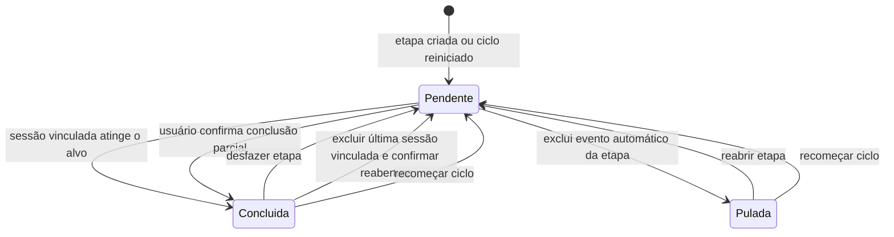

# Auditoria do fluxo Ciclo de Estudos → Previsão → Calendário → Study Organizer

**Data da análise:** 2026-06-29

**Escopo:** comportamento atual da aplicação, sem alteração funcional

**Base da análise:** código da branch `main` no commit `6f4e69c` e dez capturas fornecidas pelo usuário

**Telas principais:** Ciclo de Estudos, Previsão de Sessões, Sequência dos Estudos, Calendário e Study Organizer

## 1. Resumo executivo

O fluxo possui duas camadas diferentes:

1. `state.planejamento` guarda a estratégia e o estado operacional do ciclo:
   disciplinas, pesos, sequência, duração-alvo, datas e status de cada etapa.
2. `state.eventos` guarda as ocorrências concretas mostradas no Calendário,
   Study Organizer, Cronômetro e Histórico.

A função `syncCicloToEventos()` é a ponte entre essas camadas. Ela lê as etapas
pendentes da sequência, percorre os dias permitidos e cria eventos automáticos.
Calendário e Study Organizer não consultam diretamente a sequência: eles
renderizam os eventos que já existem em `state.eventos`.

Há, porém, duas regras diferentes para calcular o que já foi estudado:

- a barra da Sequência e a Previsão distribuem **todo o tempo concluído da
  disciplina**, mesmo quando a sessão não possui `seqId`;
- o agendador e a conclusão operacional da etapa consideram o tempo
  **explicitamente vinculado ao `seqId` da etapa**.

Essa divisão explica a principal aparente contradição das capturas:

- Direito Constitucional aparece com `2h de 2h` e `100%` na Sequência;
- a etapa ainda está operacionalmente `pendente`;
- por isso um novo evento “Estudar Direito Constitucional” aparece no
  Calendário e no Study Organizer.

O evento concluído de Constitucional registrado nas capturas durou `02:59:56`.
A barra limita o consumo da primeira etapa ao seu alvo de 120 minutos, portanto
mostra `2h de 2h`, e não `2h59min`. Como essa sessão aparentemente não estava
vinculada à etapa por `seqId`, o status da etapa não foi alterado para
`concluida`.

Também é importante distinguir:

- **18h do ciclo:** tamanho de uma rodada da sequência;
- **126h da previsão:** soma dos slots que cabem entre 25/06/2026 e 09/08/2026,
  repetindo circularmente as etapas pendentes;
- **eventos do Calendário:** materialização da projeção dentro da janela de
  agendamento;
- **Study Organizer:** recorte dos eventos de hoje até sete dias à frente.

## 2. Mapa de responsabilidades

| Responsabilidade | Fonte principal | Código relevante |
| --- | --- | --- |
| Configuração e estado do ciclo | `state.planejamento` | `src/js/logic/cycle.js` |
| Criação e replanejamento | wizard de planejamento | `src/js/planejamento-wizard.js` |
| Edição visual da sequência | cópia temporária e substituição da sequência | `src/js/views.js` |
| Progresso visual do ciclo | eventos concluídos agregados por disciplina | `src/js/views/ciclo-view.js` |
| Previsão por período | simulação dos slots, sem criar eventos | `calculateCyclePredictionsModel()` |
| Materialização no calendário | criação de eventos automáticos | `syncCicloToEventos()` |
| Calendário | leitura de `state.eventos` por data | `src/js/views/calendar-view.js` |
| Study Organizer | leitura de eventos de hoje até hoje + 7 | `src/js/views/med-view.js` |
| Cronômetro e registro | evento iniciado e formulário de sessão | `src/js/registro-sessao.js` |
| Conclusão de etapa | sessões ligadas ao `seqId` | `src/js/registro-sessao/session-save.js` |
| Persistência local | IndexedDB | `src/js/store/indexeddb.js` |
| Merge remoto do plano | LWW por `planejamento.updatedAt` | `src/js/sync/sync-center.js` |

## 3. Contratos de dados

### 3.1. `state.planejamento`

O planejamento é um objeto singleton: existe um planejamento ativo por estado.

| Campo | Função |
| --- | --- |
| `ativo` | habilita ou desabilita o planejamento |
| `tipo` | `ciclo` ou `semanal` |
| `disciplinas` | IDs das disciplinas incluídas |
| `relevancia` | importância, conhecimento, peso e percentual calculado |
| `horarios` | carga, limites de sessão, dias ativos e janela de datas |
| `sequencia` | etapas ordenadas da rodada |
| `skippedSlots` | compatibilidade com pulos posicionais de versões anteriores |
| `ciclosCompletos` | contador de rodadas reiniciadas manualmente |
| `dataInicioCicloAtual` | corte temporal usado pelo progresso visual |
| `updatedAt` | autoria temporal usada no merge LWW entre dispositivos |

Campos importantes de `horarios`:

| Campo | Efeito |
| --- | --- |
| `horasSemanais` | apesar do nome legado, define o total de horas de uma rodada do ciclo |
| `sessaoMin` | menor bloco aceito na geração inicial |
| `sessaoMax` | maior bloco por etapa |
| `diasAtivos` | dias da semana usados na previsão e no agendamento |
| `dataInicial` | começo opcional da projeção |
| `dataFinal` | fim opcional da projeção |
| `horasPorDia` | usado principalmente pela estratégia de grade semanal |

No tipo `ciclo`, `diasAtivos: []` significa comportamento livre: todos os dias
podem receber eventos. Na grade semanal, ao menos um dia ativo com horário é
obrigatório.

### 3.2. Item de `planejamento.sequencia`

| Campo | Função |
| --- | --- |
| `id` | identificador estável da etapa, normalmente `seq_*` |
| `discId` | disciplina da etapa |
| `minutosAlvo` | duração-alvo |
| `concluido` | booleano legado, ainda preservado por compatibilidade |
| `status` | estado canônico: `pendente`, `pulada` ou `concluida` |
| `puladaEm` | instante em que a etapa foi pulada |
| `finalizadoEm` | instante em que foi concluída |

Quando `status` não existe, o código usa compatibilidade:

```text
concluido === true  -> concluida
demais casos        -> pendente
```

### 3.3. Evento de estudo

Os campos relevantes para este fluxo são:

| Campo | Função |
| --- | --- |
| `id` | identificador do evento |
| `titulo` | texto mostrado nas telas |
| `data` | dia em que aparece no Calendário e Organizer |
| `duracao` | duração planejada em minutos |
| `status` | normalmente `agendado` ou `estudei` |
| `tempoAcumulado` | tempo real em segundos |
| `discId` | disciplina |
| `seqId` | vínculo explícito com uma etapa do planejamento |
| `slotIndex` | posição diária usada por eventos automáticos |
| `isAutoGenerated` | indica projeção criada pelo ciclo |
| `_timerStart` | cronômetro em execução |
| `dataEstudo` | data efetiva registrada |
| `sessao` | detalhes do estudo: tipos, materiais, questões, páginas etc. |

O campo decisivo é `seqId`. Uma sessão pode pertencer à disciplina e alimentar
estatísticas gerais sem estar vinculada a uma etapa específica.

## 4. Fontes de verdade atuais

| Informação exibida | Como é calculada |
| --- | --- |
| Status da etapa | `sequencia[].status`, com fallback em `concluido` |
| Progresso da barra da etapa | tempo de todos os eventos concluídos da disciplina desde o início da rodada |
| Progresso global do ciclo | soma do progresso visual limitado ao alvo de cada etapa |
| Restante usado pela Previsão | distribuição do tempo concluído da disciplina pelas etapas em ordem |
| Restante usado pelo agendador | eventos concluídos com o mesmo `seqId` |
| Eventos do Calendário | `state.eventos`, filtrados pelo edital principal e agrupados por data |
| Cards do Study Organizer | `state.eventos`, filtrados pelo edital principal e pela janela temporal |
| Conclusão operacional | salvamento de sessão vinculada ao `seqId` ou chamada explícita de conclusão |

Portanto, hoje não existe uma única resposta para “esta etapa já foi
estudada?”. A resposta depende de estar perguntando:

- quanto da **disciplina** foi estudado;
- quanto da **etapa vinculada** foi estudado;
- ou qual é o **status operacional** persistido.

## 5. Fluxo geral



## 6. Criação do Ciclo de Estudos

### 6.1. Etapas do wizard

O wizard possui quatro passos:

1. escolher `ciclo` ou `semanal`;
2. selecionar disciplinas ativas;
3. informar importância e conhecimento;
4. configurar carga, tamanho das sessões, dias e datas.

Para o ciclo, a validação exige:

- ao menos uma disciplina;
- `sessaoMin >= 1`;
- `sessaoMax >= sessaoMin`;
- carga total maior que zero.

As datas são opcionais. Os dias ativos também são opcionais para o ciclo.

### 6.2. Cálculo dos pesos

Para cada disciplina:

```text
fatorConhecimento = 6 - conhecimento
peso = importância × fatorConhecimento
percentual = peso ÷ somaDosPesos × 100
```

Consequências:

- importância alta aumenta a participação;
- conhecimento alto reduz a participação;
- conhecimento `0` produz fator `6`;
- conhecimento `5` produz fator `1`.

Exemplo:

```text
Importância = 5
Conhecimento = 2
Peso = 5 × (6 - 2) = 20
```

### 6.3. Conversão da carga em etapas

No tipo ciclo:

```text
totalMinutes = horasSemanais × 60
targetMinutesDaDisciplina = percentual × totalMinutes
```

O nome `horasSemanais` é legado: a interface descreve o valor como total para
fechar uma rodada, independentemente da semana do calendário.

Cada carga de disciplina é dividida em blocos:

- nenhum bloco excede `sessaoMax`;
- uma disciplina com alvo positivo abaixo de `sessaoMin` recebe pelo menos o
  mínimo;
- uma sobra final menor que `sessaoMin` pode ser descartada;
- o arredondamento por disciplina pode fazer a soma final diferir alguns minutos
  da carga originalmente informada.

### 6.4. Intercalação round-robin

Depois de criar os blocos de cada disciplina, o sistema:

1. ordena disciplinas por peso decrescente;
2. cria uma fila de blocos para cada disciplina;
3. retira um bloco de cada fila por rodada.

Isso evita, quando possível, colocar todos os blocos da mesma disciplina
consecutivamente.

### 6.5. Efeito de concluir o wizard

`generatePlanejamento()`:

1. substitui o planejamento anterior;
2. cria novos IDs de sequência;
3. zera `skippedSlots` e `ciclosCompletos`;
4. grava uma nova `dataInicioCicloAtual`;
5. remove eventos planejados pendentes;
6. preserva eventos concluídos, manuais ou com tempo real;
7. volta todas as novas etapas para `pendente`;
8. materializa novamente os eventos automáticos;
9. agenda persistência.

Como a data de início da rodada muda, sessões anteriores continuam no Histórico,
mas deixam de alimentar o progresso visual da nova rodada.

## 7. Sequência dos Estudos

### 7.1. O que a lista representa

A sequência representa uma rodada lógica, não a agenda completa. Uma etapa de
duas horas pode aparecer muitas vezes no período previsto porque, ao chegar ao
fim da lista pendente, a simulação volta ao começo.

Cada card combina:

- status persistido da etapa;
- progresso derivado dos eventos da disciplina;
- ações de início, histórico e reabertura;
- duração-alvo.

### 7.2. Progresso visual

O progresso é calculado assim:

1. selecionam-se eventos com `status === 'estudei'`;
2. usa-se apenas o período desde `dataInicioCicloAtual`;
3. somam-se minutos por `discId`;
4. os minutos são distribuídos pelas etapas daquela disciplina, na ordem;
5. cada etapa consome no máximo seu `minutosAlvo`.

Uma sessão de `02:59:56` equivale a aproximadamente 180 minutos. Se a primeira
etapa de Constitucional tem alvo de 120 minutos, ela consome 120 e exibe 100%.
O excedente só seria consumido por outra etapa posterior da mesma disciplina.

Uma etapa explicitamente `concluida` sempre é mostrada como 100%, mesmo que o
tempo vinculado tenha sido inferior ao alvo e o usuário tenha confirmado uma
conclusão antecipada.

### 7.3. Contagem “sessões concluídas”

O resumo considera concluída visualmente toda etapa cuja porcentagem chegou a
100%. Ele não exige `status === 'concluida'`.

Logo, “1 de 9 sessões concluídas” pode coexistir com uma etapa operacionalmente
pendente. Essa diferença é central para entender as capturas.

### 7.4. Edição da sequência

Ao clicar em “Editar Sequência”:

1. a sequência é clonada para uma variável temporária;
2. o usuário pode trocar disciplina ou duração;
3. pode duplicar, remover, adicionar ou mover itens;
4. “Cancelar” descarta a cópia;
5. “Salvar” substitui a sequência inteira;
6. os eventos automáticos são regenerados.

Ramificações:

- duplicar copia todos os campos e troca apenas o `id`; isso pode carregar
  `status`, `concluido`, `puladaEm` ou `finalizadoEm` para a nova etapa;
- mudar a disciplina de uma etapa preserva seu ID e status;
- remover uma etapa não remove automaticamente eventos concluídos ligados ao
  ID antigo;
- eventos históricos podem ficar com `seqId` sem etapa correspondente;
- esses eventos continuam válidos no Histórico e nos totais por disciplina.

### 7.5. Reinício e contador de ciclos

“Recomeçar Ciclo”:

- incrementa `ciclosCompletos`;
- define uma nova data de início;
- volta todas as etapas para `pendente`;
- limpa pulos e finalizações;
- remove eventos planejados pendentes;
- preserva histórico e eventos com progresso;
- gera uma nova agenda.

O reinício é manual. Não há, no fluxo de produção analisado, uma transição
automática que incremente o contador quando todas as etapas chegam a 100%.

“Zerar” altera apenas `ciclosCompletos`; não reinicia etapas.

## 8. Previsão de Sessões

### 8.1. O que a previsão faz

A previsão é uma simulação. Ela não cria eventos.

Entradas:

- data inicial;
- data final;
- dias ativos;
- `config.materiasPorDia`, padrão `3`;
- etapas com status `pendente`;
- compatibilidade com `skippedSlots`;
- minutos já estudados.

Algoritmo simplificado:

```text
para cada dia no período:
  se o dia não estiver ativo, ignorar
  repetir materiasPorDia vezes:
    pegar próxima etapa pendente
    somar uma sessão e sua duração
    avançar circularmente
```

No primeiro encontro com uma etapa, a previsão usa o restante após descontar o
tempo estudado da disciplina. Quando a sequência dá uma volta completa e visita
a etapa novamente, usa o alvo cheio, representando uma rodada futura.

### 8.2. Por que 18h viram 126h

Nas capturas:

```text
9 etapas × 2h = 18h por rodada
63 sessões previstas × 2h = 126h no período
```

Os 126h não significam que a rodada atual possui 126h. Significam que a janela
de 25/06/2026 a 09/08/2026 comporta 63 slots e que a sequência continua se
repetindo.

Se `materiasPorDia` for `3`, 63 slots equivalem a 21 datas ativas. A quantidade
exata de datas depende dos dias selecionados no planejamento, informação não
visível nas capturas.

### 8.3. Persistência das datas

Ao alterar as datas no painel:

- os valores são gravados em `planejamento.horarios`;
- `touchPlanejamento()` atualiza `updatedAt`;
- o estado é persistido;
- a mesma janela passa a limitar a geração dos eventos automáticos.

Portanto, as datas não são um filtro descartável da tela: elas também alteram a
agenda materializada.

### 8.4. Diferença para o agendador

A previsão desconta todo estudo concluído da disciplina. O agendador calcula o
restante por etapa usando apenas eventos com o mesmo `seqId`.

Exemplo observado:

```text
Sessão concluída de Constitucional: aproximadamente 180min, sem seqId
Barra da etapa: consome 120min e mostra 100%
Primeira visita da previsão: pode considerar 0min restantes
Status da etapa: continua pendente
Agendador: encontra 0min vinculados ao seqId e agenda novamente 120min
```

Essa é uma divergência de modelo, não apenas uma diferença visual.

## 9. Materialização no Calendário

`syncCicloToEventos()` transforma etapas em eventos.

### 9.1. Limpeza anterior à regeneração

Antes de criar a nova agenda, são removidos eventos que:

- possuem `isAutoGenerated`;
- não foram concluídos;
- não têm tempo acumulado;
- são de hoje ou do futuro.

São preservados:

- eventos manuais;
- eventos concluídos;
- eventos com qualquer progresso real;
- eventos automáticos que ficaram no passado.

### 9.2. Janela de geração

O início é:

```text
maior valor entre hoje e horarios.dataInicial
```

O fim é:

- `horarios.dataFinal`, limitado a 365 dias; ou
- 14 dias de projeção, quando não existe data final.

Somente dias ativos recebem eventos. No ciclo, uma lista vazia de dias permite
todos os dias.

### 9.3. Ordem e repetição

O agendador filtra apenas etapas `pendente`. Etapas `pulada` e `concluida`
saem da fila.

Para cada slot diário, ele:

1. pega a próxima etapa pendente;
2. calcula o restante vinculado ao `seqId`;
3. cria um evento automático;
4. avança circularmente.

O evento recebe `seqId`, `slotIndex` e `isAutoGenerated: true`.

## 10. Calendário e suas ações

O Calendário é uma visualização de `state.eventos`. Ele:

- filtra pelo edital principal;
- agrupa eventos por `data`;
- mostra status derivado;
- abre o detalhe do evento;
- permite iniciar, concluir, editar ou excluir.

### 10.1. Excluir um evento automático pendente

Excluir um card automático ligado a uma etapa não significa apenas apagar aquela
ocorrência.

O fluxo atual:

1. localiza a etapa pelo `seqId`;
2. altera seu status para `pulada`;
3. grava `puladaEm`;
4. remove o evento selecionado;
5. regenera a agenda;
6. todas as ocorrências da etapa pulada desaparecem;
7. as demais etapas compactam os slots.

Esse comportamento explica a passagem de Administrativo para “Etapa pulada” e a
entrada de Constitucional no lugar vago.

### 10.2. Reabrir etapa pulada

“Reabrir etapa”:

- volta o status para `pendente`;
- remove `puladaEm` e `finalizadoEm`;
- regenera eventos;
- permite que a disciplina volte à previsão, ao Calendário e ao Organizer.

### 10.3. “Limpar agendados”

Essa ação é diferente da exclusão individual:

- remove em lote eventos automáticos de hoje ou do futuro;
- somente remove os que não foram concluídos e não possuem tempo;
- preserva manuais, concluídos, eventos com progresso e eventos passados;
- não muda o status das etapas;
- não registra um pulo por etapa;
- não chama `syncCicloToEventos()` imediatamente.

Consequência: os cards somem naquele momento, mas podem reaparecer quando outra
ação regenerar o ciclo, por exemplo:

- mudar `materiasPorDia`;
- editar a sequência;
- concluir ou reabrir uma etapa;
- alterar a carga;
- recomeçar o ciclo.

O texto “esta ação não pode ser desfeita” descreve a exclusão dos objetos de
evento, mas não comunica que eles são projeções derivadas e podem ser recriados.

## 11. Study Organizer

O Study Organizer também lê `state.eventos`; ele não consulta a sequência.

### 11.1. Filtro temporal

São considerados eventos:

```text
data >= hoje
data <= hoje + 7 dias
status diferente de estudei, para a agenda futura
```

Como os limites são inclusivos, a lista cobre hoje mais sete dias posteriores:
até oito datas de calendário.

Grupos:

- Agendado para Hoje;
- Amanhã;
- Próximos 7 dias;
- Em Andamento;
- Estudado Hoje.

### 11.2. Indicadores

| Indicador | Regra |
| --- | --- |
| Tempo Total Hoje | soma de `tempoAcumulado` dos eventos concluídos cuja `data` é hoje |
| Pendentes | eventos de hoje não concluídos, incluindo os em andamento no card de estatística |
| Maior Foco | evento concluído hoje com maior tempo |
| Badge lateral | quantidade de eventos pendentes de hoje |
| Meta diária | tempo concluído hoje dividido por `metaDiariaMin` |

Embora a lista mostre eventos futuros, o card “Pendentes” e o badge lateral
contam apenas hoje. Essa diferença é intencional no código, mas pode surpreender
quem interpreta o número como total da lista visível.

## 12. Início e registro de uma sessão



### 12.1. Iniciar pelo card automático

O Cronômetro usa o próprio evento automático. Como ele já possui `seqId`, o
registro pode avançar a etapa.

### 12.2. Iniciar pela Sequência

“Iniciar Estudo” cria um novo evento para hoje com `seqId`, inicia seu timer e
navega ao Cronômetro.

Se a etapa tem progresso parcial vinculado:

- o sistema mostra quanto já foi estudado;
- calcula a duração restante;
- oferece “Retomar anterior” ou “Criar nova sessão”;
- ambas as opções criam uma nova ocorrência com metadados sobre o modo parcial.

Enquanto a nova sessão ainda não foi concluída, outros eventos automáticos da
mesma etapa podem continuar visíveis. A regeneração ocorre ao salvar a sessão.

### 12.3. Sessão parcial

Ao salvar uma sessão vinculada:

- se a soma ligada ao `seqId` atingiu o alvo, a etapa conclui automaticamente;
- se ficou abaixo, o sistema pergunta se deve concluir mesmo assim;
- cancelar mantém a etapa pendente e gera eventos com o restante;
- confirmar marca a etapa como concluída mesmo com tempo inferior.

### 12.4. Sessão manual ou livre

Quando existe planejamento pendente, o formulário pode mostrar:

> Vincular à próxima etapa pendente desta disciplina no planejamento

Sem marcar:

- a sessão é salva na disciplina;
- alimenta Histórico, Dashboard, hábitos e estatísticas;
- também alimenta o progresso visual e a Previsão atuais;
- não recebe `seqId`;
- não altera o status da etapa;
- não reduz o restante usado pelo agendador.

Marcando:

- o sistema encontra a primeira etapa pendente daquela disciplina;
- grava o `seqId`;
- aplica as regras de conclusão parcial ou total.

## 13. Estados e transições



Observação: chegar visualmente a 100% por tempo não vinculado não aparece nesse
diagrama porque, no estado persistido, não ocorre transição.

## 14. Exclusão de uma sessão concluída

Ao excluir uma sessão do Histórico:

1. a sessão e hábitos associados são removidos;
2. tombstones impedem que o sync ressuscite os registros;
3. totais derivados são invalidados;
4. se a sessão possuía `seqId`, procura-se a etapa;
5. se não existe outra sessão concluída com o mesmo `seqId`, o sistema pergunta
   se a etapa deve ser reaberta.

Se o usuário confirmar:

- a etapa volta para `pendente`;
- previsões e eventos podem ser gerados novamente.

Se cancelar:

- o registro desaparece;
- a etapa continua `concluida`;
- a barra permanece em 100% porque o status concluído força essa exibição.

Sessões sem `seqId` não oferecem reabertura. Sua exclusão apenas reduz os totais
derivados da disciplina, o que pode fazer a barra visual cair.

## 15. Replanejar e remover planejamento

### 15.1. Replanejar

O wizard carrega as configurações atuais, mas ao concluir gera uma sequência
inteiramente nova.

Efeitos:

- novos IDs de etapa;
- status reiniciados;
- contador de ciclos zerado;
- nova data de início;
- eventos pendentes antigos removidos;
- eventos concluídos preservados no Histórico.

### 15.2. Remover planejamento

Remover:

- desativa o planejamento;
- esvazia a sequência;
- remove eventos planejados pendentes;
- preserva sessões concluídas, eventos manuais e eventos com tempo.

Calendário e Organizer podem continuar exibindo esses registros preservados,
mesmo sem planejamento ativo.

## 16. Persistência e sincronização

### 16.1. Persistência local

O aplicativo é local-first:

```text
mutação do estado
  → scheduleSave()
  → debounce
  → IndexedDB
  → evento stateSaved
  → sincronização opcional
```

O registro de sessão usa `saveStateToDB()` diretamente porque é considerado um
dado crítico. Depois do save, invalida caches, atualiza badges e renderiza a
tela.

### 16.2. `touchPlanejamento()`

Toda mutação real do plano deve atualizar `planejamento.updatedAt`, por exemplo:

- pular ou reabrir etapa;
- concluir etapa;
- editar ordem ou duração;
- recomeçar ciclo;
- alterar a janela da previsão.

A simples regeneração de eventos não chama `touchPlanejamento()`. Isso evita que
cada dispositivo reivindique autoria do plano só por recalcular projeções.

### 16.3. Merge remoto

O planejamento inteiro usa last-write-wins:

```text
planejamento com updatedAt mais recente vence
```

Eventos são mesclados por ID e exclusões reais usam tombstones.

Eventos automáticos pendentes, sem tempo, são tratados como derivados:

- não recebem tombstone quando excluídos;
- podem ser regenerados a partir do planejamento;
- usam IDs produzidos localmente.

Isso reforça a distinção entre:

- plano como intenção persistida;
- evento automático como projeção descartável;
- sessão concluída como histórico real.

## 17. Reconstrução cronológica das capturas

### 17.1. 17:38:28 — estado inicial da sequência

A Sequência mostra:

- Administrativo: `0h de 2h`;
- Civil: `0h de 2h`;
- Constitucional: `2h de 2h`, `100%`;
- demais etapas pendentes.

O ciclo possui nove etapas de duas horas:

```text
9 × 2h = 18h
```

### 17.2. 17:38:34 — projeção inicial no Organizer

O Organizer mostra Administrativo e Civil agendados para 29/06/2026.

Isso corresponde aos primeiros slots materializados da sequência pendente.

### 17.3. 17:38:40 e 17:38:51 — sessão concluída de Constitucional

O Calendário/Histórico mostra uma sessão concluída de Constitucional com
`02:59:56`. O Study Organizer mostra:

- tempo total: `02:59:56`;
- dois pendentes;
- um concluído;
- maior foco: Constitucional.

Apesar dos 180 minutos reais, a etapa visual consome somente seu alvo de 120
minutos.

### 17.4. 17:39:46 a 17:40:28 — Administrativo é pulado

Administrativo desaparece da agenda e o card da Sequência passa a mostrar
“Etapa pulada”.

Isso é compatível com a exclusão de um evento automático:

```text
excluir ocorrência
  → status da etapa = pulada
  → regenerar agenda
  → remover Administrativo de todos os slots
```

### 17.5. 17:39:46 a 17:40:59 — Civil e Constitucional ocupam os slots

O Organizer passa a mostrar:

- Estudar Direito Civil;
- Estudar Direito Constitucional.

O Calendário mostra no mesmo dia:

- a sessão concluída de Constitucional;
- Civil pendente;
- Constitucional pendente.

Civil é a próxima etapa pendente. Constitucional aparece logo depois porque,
apesar do 100% visual, seu status operacional continuou pendente.

### 17.6. 17:41:05 — resumo final

A tela final mostra:

- `2h de 18h`;
- `faltam 16h`;
- `1 de 9 sessões concluídas`;
- `11%`;
- Administrativo pulado;
- Civil 0%;
- Constitucional 100%;
- 63 sessões previstas;
- 126h totais.

Cálculos:

```text
2h ÷ 18h = 0,1111... → 11%
63 × 2h = 126h
```

O texto “1 de 9 sessões concluídas” é visual: conta a etapa que alcançou 100%,
mesmo sem transição persistida para `concluida`.

## 18. Ramificações completas

| Ação | Planejamento | Eventos | Previsão | Calendário/Organizer |
| --- | --- | --- | --- | --- |
| Criar planejamento | cria nova sequência pendente | remove projeções antigas pendentes e gera novas | usa nova sequência | mostra novos eventos |
| Alterar datas | muda `horarios` e `updatedAt` | próxima sincronização usa a nova janela | recalcula imediatamente | agenda passa a respeitar as datas |
| Alterar `materiasPorDia` | não muda etapas | regenera quantidade diária | recalcula slots | quantidade diária muda |
| Estudar evento automático | mantém etapa até salvar | usa o próprio evento com `seqId` | reage ao registro | card vira concluído ou parcial |
| Iniciar pela sequência | não muda status imediatamente | cria novo evento com `seqId` | sem mudança até salvar | pode coexistir temporariamente com projeções |
| Sessão vinculada completa | etapa `concluida` | preserva histórico e remove projeções futuras da etapa | etapa sai da fila | cards futuros somem |
| Sessão vinculada parcial, cancelar conclusão | etapa `pendente` | histórico parcial preservado | usa restante | novos cards usam restante vinculado |
| Sessão vinculada parcial, confirmar | etapa `concluida` | histórico preserva tempo real | etapa sai da fila | projeções futuras somem |
| Sessão manual sem vínculo | status não muda | cria histórico sem `seqId` | atualmente reduz o restante visual | agendador pode continuar criando a etapa cheia |
| Sessão manual com vínculo | pode concluir a primeira etapa pendente da disciplina | recebe `seqId` | reage como sessão planejada | agenda é regenerada |
| Excluir evento automático | etapa vira `pulada` | ocorrência é removida | etapa sai da fila | demais etapas compactam |
| Reabrir etapa pulada | volta para `pendente` | regenera projeções | etapa volta à fila | cards podem reaparecer |
| Limpar agendados | status não muda | remove projeções pendentes em lote | não muda | cards podem voltar em sincronização futura |
| Excluir sessão concluída vinculada | pode reabrir após confirmação | remove sessão e hábitos | recalcula | agenda pode ser regenerada |
| Editar sequência | substitui toda a lista | regenera projeções | usa nova ordem | agenda acompanha a nova ordem |
| Recomeçar ciclo | incrementa contador e reseta status | preserva histórico, recria pendentes | inicia nova rodada | nova agenda |
| Zerar contador | apenas contador vira zero | sem efeito | sem efeito | sem efeito |
| Remover planejamento | desativa e esvazia sequência | remove pendentes planejados | deixa de existir | histórico/manual permanece |

## 19. Achados da auditoria

### A1 — Alto: regra opt-in contradita pelo progresso por disciplina

**Fato comprovado**

O formulário afirma que a sessão manual só será vinculada ao planejamento quando
a opção for marcada. O salvamento respeita isso para `seqId` e status.

Entretanto, a barra e a previsão somam qualquer sessão concluída da disciplina,
inclusive sessão livre sem vínculo.

**Impacto**

- uma etapa pode mostrar 100% sem estar concluída;
- a pessoa acredita que avançou, mas a agenda continua repetindo a matéria;
- excluir a sessão não oferece reabertura, pois ela nunca esteve vinculada;
- a mesma atividade tem efeitos diferentes dependendo da tela observada.

**Recomendação**

Adotar como regra padrão que somente sessões com `seqId` alteram:

- progresso das etapas;
- previsão do ciclo;
- restante do agendador;
- status operacional.

Sessões não vinculadas continuariam alimentando Dashboard, Histórico, hábitos e
totais gerais da disciplina.

### A2 — Alto: Previsão e agendador calculam o restante por fontes diferentes

**Fato comprovado**

- Previsão: tempo agregado por disciplina;
- agendador: tempo concluído com o mesmo `seqId`.

**Impacto**

- duração prevista pode não coincidir com a duração do evento criado;
- uma etapa zerada na primeira visita da Previsão pode aparecer cheia no
  Calendário;
- a Sequência comunica uma ordem diferente da operacional.

**Recomendação**

Extrair uma única função de domínio para calcular progresso e restante por
etapa. Sequência, Previsão, agendador e modal de histórico devem consumir o mesmo
resultado.

### A3 — Médio: fechamento automático descrito, mas não implementado

**Fato comprovado**

O wizard diz que, ao atingir as horas, “o ciclo zera e as matérias se repetem”.
No código de produção, `ciclosCompletos` só aumenta em “Recomeçar Ciclo”.

**Impacto**

- expectativa de avanço automático;
- todas as etapas podem ficar concluídas sem nova rodada;
- contador não representa necessariamente rodadas efetivamente completadas.

**Recomendação**

Escolher uma semântica:

1. implementar rollover automático e testável; ou
2. manter reinício manual e alterar os textos para “quando você decidir fechar a
   rodada”.

### A4 — Médio: edição pode preservar status incompatíveis

**Fato comprovado**

Duplicar uma etapa clona todos os campos e troca apenas o ID. Trocar disciplina
ou duração também preserva status e timestamps existentes.

**Impacto**

- duplicação de etapa concluída pode nascer concluída;
- duplicação de etapa pulada pode nascer pulada;
- uma etapa concluída pode ser movida para outra disciplina mantendo o status;
- remoções podem deixar sessões históricas com `seqId` órfão.

**Recomendação**

Normalizar itens editados:

- duplicação deve nascer `pendente`, sem timestamps;
- mudança de disciplina deve pedir confirmação e reiniciar status;
- remoção deve informar quantas sessões concluídas ficarão somente no Histórico.

### A5 — Médio: “Limpar agendados” é temporário, mas parece definitivo

**Fato comprovado**

A ação remove eventos derivados sem alterar as etapas e sem registrar pulo. Uma
regeneração futura pode recriá-los.

**Impacto**

- cards “apagados permanentemente” retornam;
- o comportamento difere da lixeira de um card;
- o usuário pode interpretar o retorno como falha de persistência ou sync.

**Recomendação**

Renomear para “Ocultar projeções atuais” ou oferecer escolhas explícitas:

- limpar somente os eventos gerados;
- pular etapas correspondentes;
- pausar a geração automática.

### A6 — Baixo: horizonte e contador do Organizer têm semânticas diferentes

**Fato comprovado**

- a lista usa hoje até hoje + 7, inclusivo;
- o card “Pendentes” conta apenas hoje.

**Impacto**

O número não corresponde à quantidade de cards futuros visíveis.

**Recomendação**

Usar rótulos mais precisos:

- “Pendentes hoje”;
- “Hoje e próximos 7 dias” para a lista.

## 20. Alternativa de produto: todo estudo da disciplina conta

Se a intenção for que qualquer sessão da disciplina avance o ciclo, a solução
não deve manter o estado híbrido atual.

Nesse modelo alternativo:

1. toda sessão concluída é distribuída pela próxima etapa pendente da disciplina;
2. o sistema cria ou registra internamente o vínculo consumido;
3. ao atingir o alvo, altera o status para `concluida`;
4. agendador, previsão e barra usam a mesma distribuição;
5. o formulário deixa de apresentar o vínculo como opt-in ou explica que a opção
   escolhe apenas qual etapa será consumida.

Essa alternativa exige regras para:

- disciplinas repetidas na sequência;
- sessões maiores que uma etapa;
- consumo atravessando mais de uma etapa;
- edição ou exclusão retroativa;
- concorrência entre dispositivos.

Por isso, para o comportamento e os textos atuais, o modelo explícito por
`seqId` é a opção mais previsível.

## 21. Recomendações de testes para uma correção futura

Nenhum teste foi alterado nesta auditoria. Se os achados forem corrigidos,
priorizar:

1. sessão manual sem opt-in não altera barra, previsão ou status;
2. sessão manual com opt-in altera exatamente uma etapa;
3. Previsão e evento gerado retornam o mesmo restante;
4. etapa visualmente 100% não permanece operacionalmente pendente;
5. duplicar etapa concluída cria uma etapa pendente;
6. remover etapa com histórico informa a consequência;
7. “Limpar agendados” tem comportamento e texto coerentes;
8. ciclo completo aplica a política escolhida para rollover;
9. Organizer usa rótulos compatíveis com seu horizonte e seus contadores;
10. merge entre dispositivos preserva status, vínculo e exclusões.

## 22. Conclusão

O desenho geral é compreensível:

```text
planejamento define a intenção
→ sequência ordena a rodada
→ previsão simula slots
→ sync materializa eventos
→ Calendário e Organizer exibem eventos
→ registro devolve progresso ao planejamento
```

O problema principal não está nessa cadeia, mas na existência de duas regras
para devolver progresso:

- regra ampla por disciplina;
- regra explícita por `seqId`.

As capturas demonstram exatamente o ponto em que essas regras se separam:
Constitucional está completa para a barra, mas pendente para o agendador. A
correção mais coerente com a interface atual é tornar o vínculo explícito a única
fonte de progresso do planejamento, mantendo sessões livres apenas nas
estatísticas gerais.

## 23. Adendo — decisão de produto e correção aplicada (2026-07-01)

O usuário decidiu pelo modelo alternativo da seção 20: **todo estudo da
disciplina conta**, com reconciliação automática de status. A implementação
está descrita em
`docs/handoffs/handoff-2026-07-01-ciclo-todo-estudo-conta.md`. Em resumo:

- núcleo puro `src/js/logic/cycle-progress.js` é a fonte única de progresso
  (barra, Previsão, agendador, conclusão e merge de sync);
- etapas concluem automaticamente com a flag `autoConcluida` e reabrem se a
  sessão que as sustentava for excluída; conclusões manuais nunca regridem;
- a reconciliação não altera `planejamento.updatedAt` (o merge re-deriva o
  status sobre os eventos mesclados em cada dispositivo);
- o checkbox opt-in de vínculo foi removido; `seqId` virou metadado;
- achados A3 (banner manual de ciclo completo), A4, A5 e A6 corrigidos;
- bug adicional corrigido: etapas `pulada` consumiam minutos na distribuição.
